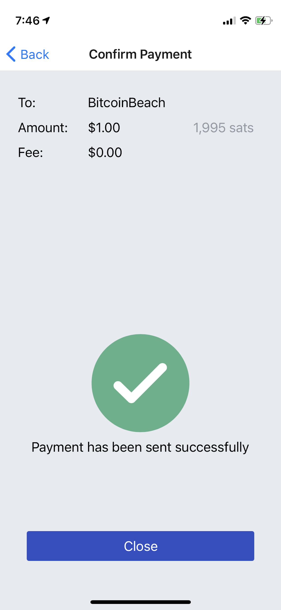
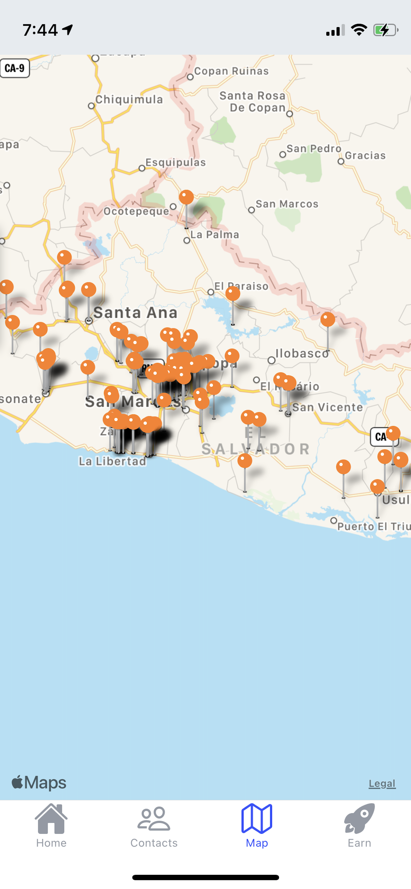

# GaloyMobile

## Goal

This repository is the Blink mobile application. The goal is to make a mobile application compatible with Galoy's backend that can be customized and used by any community or organization. It is built with [React Native](https://reactnative.dev/), and runs on both iOS and Android.

## Screenshots

   

## Contributing

If you wish to contribute see [CONTRIBUTING.MD](./CONTRIBUTING.MD)

## Start

Prerequisite -- [Set up React Native](https://reactnative.dev/docs/environment-setup) by following the instructions in the **React Native CLI Quickstart** tab

Clone into the project

cd into the directory

type `yarn install`

type `yarn start`

In another window
type `yarn ios` or `yarn android` to run locally.

The app is built and pushed to the App Store and Play Store on demand with CircleCI.

To run the app fully locally the backend must also be set up by following the instructions at https://github.com/GaloyMoney/galoy.

---

### _Notes for Running on M1 Mac:_

The app currently only builds for x86_64 simulators. Simulators prior to IOS 13.7 are x86_64 by default, however starting with 13.7 they become platform specific. In order to get an x86_64 simulator of a newer IOS version, one must set XCode to open in [emulation using Rosetta](https://www.macworld.com/article/338843/how-to-force-a-native-m1-mac-app-to-run-as-an-intel-app-instead.html). To run the project, open [GaloyApp.xcworkspace](./ios/GaloyApp.xcworkspace/) in XCode, choose an x86_64 simulator, and click the play button. This should start the Metro bundler in a new terminal as well as launch the simulator with the app.

---

## Running Storybook

From the command line in your generated app's root directory, enter `yarn storybook`
This starts up the storybook server.

In `index.js`, change `SHOW_STORYBOOK` to `true` and reload the app and run `yarn storybook`.

For Visual Studio Code users, there is a handy extension that makes it easy to load Storybook use cases into a running emulator via tapping on items in the editor sidebar. Install the `React Native Storybook` extension by `Orta`, hit `cmd + shift + P` and select "Reconnect Storybook to VSCode". Expand the STORYBOOK section in the sidebar to see all use cases for components that have `.story.tsx` files in their directories.

## E2E testing:

see [readme](docs/e2e-testing.md)

## Local development with libraries

The mobile app uses the [galoy-client](https://github.com/GaloyMoney/galoy-client) for generic functions, such as parsing bitcoin transactions, lightning invoice, or managing translations across the different frontend of the Galoy stack. If you want to make changes to the galoy-client locally to test changes in the app e.g. you want to add a key to the translations file this is the steps you should take. Since the metro bundler [does not support](https://github.com/facebook/metro/issues/68) `yarn link`, we have to use [yalc](https://www.npmjs.com/package/yalc).

**Before you run these commands the client will need to be published using `yalc`. Instructions for this are included in the readme for the client.**

`npx yalc add @galoymoney/client`

When you are finished developing locally and are ready to push to github you will need to remove the yalc dependency using the following command.

`npx yalc remove @galoymoney/client`

## Adding new fonts

**These instructions are correct as of react-native 0.69. If you are using a different version, you may need to adjust the instructions.**

1. Add the new fonts to the `app/assets/fonts` directory.
2. Run `yarn fonts` to link the font files to the native projects.
3. You should see the new font in the `ios/GaloyApp/Info.plist` file and the `android/app/src/main/assets/fonts` directory.

## Adding translation keys

To add a new string to be used in the application navigate to [en/index.ts](app/i18n/en/index.ts) and add the phrase you need in english. Proceed to run the command `yarn update-translations`. This command will update the translation types as well as the raw english translation file. The new phrase can now be used throughout the application, with all languages falling back to the english translation.

**Warning**: Do not update files in the [raw translations folder](/app/i18n/raw-i18n/). These files are managed programtically.

## Icons

**Warning**
We use [react-native-vector-icons](https://github.com/oblador/react-native-vector-icons) in this repo. Our main component library [react-native-elements](https://github.com/react-native-elements/react-native-elements) also uses the icons from this set in some of the components. We have added custom icons from the Ionicons sets to the existing components we import from the library. If you import a new component from react native elements which uses an icon from a set which isn't Ionicons then it might not render on the screen.

## Debugging

You can use the react native debugger with chrome or a standalone tool called `react-native-debugger` https://github.com/jhen0409/react-native-debugger to set breakpoints. With that tool you can view state with the included apollo dev tools. To enabled debugging you must turn off hermes in Android `android/gradle.properties` set `hermesEnabled=false` (at least, until this is fixed: https://github.com/facebook/react-native/issues/35600)
