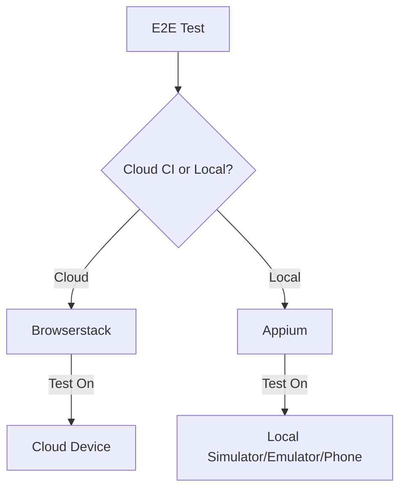

# E2E Testing



## We use appium v2

install with:

```
npm install -g appium@next
appium driver install uiautomator2
appium driver install xcuitest
```

verify install is correct:

`appium --version` should show v2

Note: appium can only be (officially) install with npm, not yarn.
`npm -g install npm` can be handy if you have an old npm version.

## To Test locally with Appium and Webdriver:

1. run the debug version of the app `yarn android` or `yarn ios`
2. In a new terminal run `yarn start:appium`
3. In a new terminal run `yarn test:e2e:android` or `yarn test:e2e:ios`

## To Test with Browserstack (cloud devices):

\*\* this will eventually be integrated into CI, but for now you can test locally if you have
access to browserstack.com

```
export BROWSERSTACK_USER=YOURUSER
export BROWSERSTACK_ACCESS_KEY=YOURKEY
export BROWSERSTACK_APP_ID=bs://YOURAPPID
```

run `yarn test:browserstack:android`

## To Test Locally

### Getting the Name of an Android or IOS device

There is a script in `bin/get-testing-device.sh` that will automatically get the name of the android or ios device and set the env vars `TEST_DEVICE_ANDROID` and `TEST_DEVICE_IOS`

You can also manually set the environment variable for the test device like this:

Android

```
TEST_DEVICE_ANDROID="Pixel 3 API 29" yarn test:e2e:android
TEST_APK_PATH="./android/app/build/outputs/apk/debug/app-universal-debug.apk"
```

IOS

```
TEST_DEVICE_IOS="iPhone 13" yarn test:e2e:ios
```

Here are the other env variables you need to set

```
GALOY_TEST_TOKENS={YOUR_TOKEN}
GALOY_TOKEN_2={SECOND_WALLET_TOKEN}
MAILSLURP_API_KEY={MAILSLURP_API_KEY}
E2E_DEVICE={ios or android}
```

to simplify your workflow, you can put those env variables in a .env and use [direnv](https://direnv.net/)

## Running Specific Tests without Clearing State

If you would like to run specific tests without clearing any state in the application, you can use the following command.

```
yarn test-ios [test-name]
```

## Troubleshooting

If you have any issues with appium then run `yarn appium-doctor`

## Finding Elements

Appium uses `Accessibility Labels` to locate components, such as buttons.

```ts
// This is used for E2E tests to apply id's to a <Component/>
// Usage:
//  <Button {...testProps("testID")} />
export const testProps = (testID: string) => {
  return {
    testID,
    accessible: true,
    accessibilityLabel: testID,
  }
}
```

You can install `appium inspector` https://github.com/appium/appium-inspector to find elements in the GUI. It can be configured by setting the `remote path` to `/wd/hub` and then using the `Desired Capabilities JSON representation`, example below. (make sure to input your simulator or android emulator settings):

ios

```
{
  "platformName": "iOS",
  "appium:deviceName": "iPhone 13",
  "appium:bundleId": "io.galoy.bitcoinbeach",
  "appium:automationName": "XCUITest"
}
```

android

```
{
  "platformName": "Android",
  "appium:app": "/path/to/code/galoy-mobile/android/app/build/outputs/apk/debug/app-universal-debug.apk",
  "appium:deviceName": "generic_x86",
  "appium:automationName": "UiAutomator2"
}
```

ios on browserstack - choose 'select cloud providers' then 'browserstack'

```
{
  "appium:deviceName": "iPhone 13",
  "appium:automationName": "XCUITest",
  "appium:platformVersion": "15.1",
  "appium:app": "bs://{YOUR_BROWSERSTACK_ID_FROM_CIRCLE_CI}"
}
```

## Develop locally

To disable state reset between tests, you can set the `NO_RESET` env variable to `true`

```
